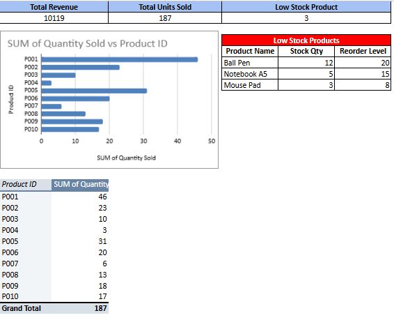

# MIS-Sales-Inventory-Dashboard
Dynamic Excel-based MIS dashboard for Sales &amp; Inventory management.
---

## ✅ Project Overview
This is a simple project that demonstrates an **MIS (Management Information System) Dashboard** built using **Google Sheet** to monitor key business metrics for **Sales and Inventory Management**. The dashboard provides **real-time insights** into sales performance and inventory health, helping businesses make data-driven decisions.

---

## 🛠 Features
- **Dynamic Dashboard**:
  - Total Sales Amount
  - Total Units Sold
  - Low Stock Alerts
- **Low Stock Products Report**:
  - Automated using `FILTER` function
- **Sales & Inventory Integration**:
  - Auto-populate Unit Price in Sales sheet using `VLOOKUP`
- **KPI Highlights** with Conditional Formatting:
  - Visual indicators for low stock and performance

---

MIS-Sales-Inventory-Dashboard/
│
├── Sales_Inventory.xlsx   # Main Excel dashboard file
├── image.png/             # Dashboard preview          
└── README.md              # Project documentation

---

## 📸 Screenshots
### Dashboard View
*(Add your screenshot here, e.g.)*

---

## 🔑 Key Excel Functions Used
- `VLOOKUP` → Auto-fetch Unit Price in Sales sheet  
- `SUMIF` → Calculate total units sold and sales amount  
- `FILTER` → Generate Low Stock list dynamically  
- Conditional Formatting → Highlight low stock and KPIs  

---

## ✅ Skills Demonstrated
- **MIS Reporting**
- **Excel Data Analysis**
- **Dashboard Design**
- **Inventory & Sales Analytics**
- **Business Intelligence Basics**

---
